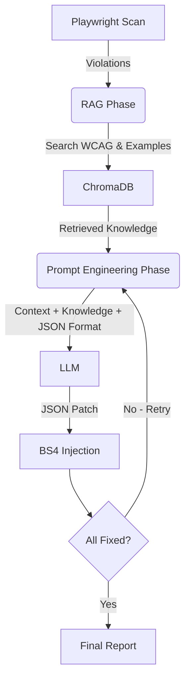

This document outlines the underlying methodology, architecture, and prompt engineering strategies used by the automated accessibility validator pipeline.

## 🏗️ Architecture Overview

The system is split into two distinct AI phases: **The Retrieval Phase (RAG)** and **The Synthesis Phase (Prompt Engineering)**.



---

## 🔍 Phase 1: Retrieval (RAG)
The RAG (Retrieval-Augmented Generation) layer is responsible for providing the LLM with **external knowledge** that it wasn't trained on (or might forget).

*   **Knowledge Base**: A vector database (ChromaDB) containing two data sources:
    1.  **Static Definitions**: Text descriptions of WCAG guidelines from `wcag.json`.
    2.  **Dynamic Patterns**: Practical "Bad vs Good" code snippets from `wcag_examples.json`.
*   **The Logic**: 
    1.  The system takes the violation description (e.g., "Links must have discernible text").
    2.  It creates a **Vector Embedding** of this issue.
    3.  It finds the **Top 3** most similar guidelines in the database.
*   **Outcome**: The RAG phase ends when the system has a collection of text guidelines and code examples ready to be handed off.

---

## ✍️ Phase 2: Synthesis (Prompt Engineering)
Prompt Engineering is the **instructional design** layer. It takes the "Knowledge" from the RAG phase and structures it into a format the LLM can act upon.

*   **Role Definition**: Setting the LLM's persona as an expert accessibility developer.
*   **Structured Output Design**: Defining the strict JSON schema (`modify_attributes` vs `replace_html`) to ensure the response is machine-readable and safe for DOM injection.
*   **Contextual Assembly**: Organizing the Parent DOM node, the RAG knowledge, and the violation details into a logical hierarchy (Least specific to most specific).
*   **Self-Reflection Logic**: If a retry is triggered by the Agentic Loop, Prompt Engineering handles the "correction instruction" by injecting the previous failure into the prompt.

---

## 🛠️ Summary Table: RAG vs. Prompt Engineering

| Feature | RAG Phase (The "Knowledge") | Prompt Engineering Phase (The "Logic") |
| :--- | :--- | :--- |
| **Primary Tool** | ChromaDB / Embeddings | System Prompt / JSON Schema |
| **Responsibility** | Finding the right WCAG rule | Instructing the LLM how to apply the rule |
| **Input** | The violation description | RAG data + Parent DOM + Failure history |
| **Output** | 3 Guidelines + 3 Code Examples | A single, structured JSON instruction |

---

## 1. Pipeline Structure

The pipeline is designed to be highly parallelized and resilient, ensuring fast execution times and robust DOM manipulation. It operates as an **Agentic Feedback Loop**.

### Step-by-Step Execution Flow:
1. **Input Reception**: The pipeline accepts either a live URL (which is scraped using Playwright) or raw HTML code.
2. **Baseline Accessibility Scan**: The raw HTML is loaded into a headless Playwright browser. The `axe-core` library analyzes the DOM and outputs a list of all WCAG violations.
3. **Agentic Feedback Loop**: The pipeline enters a multi-pass validation loop (up to 3 iterations).
4. **DOM Context Extraction**: For each violation, the system extracts up to 1000 characters of its **Parent Node** using `BeautifulSoup` to provide spatial context.
5. **Retrieval-Augmented Generation (RAG)**: The system retrieves official WCAG guidelines AND dynamic code examples relevant to the specific violation.
6. **Parallel LLM Execution**: Violation details, parent context, RAG guidelines, and any **previous failures** are compiled into a prompt. A `ThreadPoolExecutor` dispatches concurrent requests to the LLM.
7. **Structured JSON Patching**: The LLM outputs a strict JSON object defining the fix action (e.g., `modify_attributes` or `replace_html`).
8. **In-Memory Caching**: Identical violations are cached to prevent redundant API calls.
9. **Robust DOM Injection**: Fixes are injected using `BeautifulSoup` selectors. `modify_attributes` allows for safe attribute injection without disturbing nested DOM structures.
10. **Validation Scan & Self-Reflection**: The corrected DOM is rescanned. If a violation persists on the same node, the failed attempt is recorded and fed back into the next iteration of the loop for self-correction.
11. **Final Metrics**: Once the loop completes, severity scores are compared to calculate the total percentage improvement.

---

## 2. RAG (Retrieval-Augmented Generation) Structure

The RAG pipeline provides the LLM with authoritative context and practical coding patterns.

* **Document Corpus**: A structured `wcag.json` file for definitions and a supplementary `wcag_examples.json` for code patterns.
* **Vector Database**: `ChromaDB` running locally.
* **Embedding Model**: `mxbai-embed-large` (via Ollama).
* **Retrieval Strategy**: 
    * The system queries the database using a **semantic statement** (Issue + Help hint).
    * It retrieves the **Top 3** most relevant guidelines.
    * **Dynamic Few-Shot Injection**: For each retrieved guideline, the system checks `wcag_examples.json` for corresponding "Bad Code" vs "Good Code" examples and injects them directly into the prompt.

---

## 3. Prompt Structure

The prompt is designed to elicit structured, actionable responses while minimizing hallucinations through contextual grounding and self-reflection.

### System Prompt
The System Prompt enforces strict **JSON Output** and defines the available patching actions (`modify_attributes` vs `replace_html`).

### User Prompt
The User Prompt is dynamically generated using these primary variables:

1. **Context (Parent Node)**: Surrounding HTML structure.
2. **Relevant WCAG Guidelines**: Official rules retrieved by RAG.
3. **WCAG Code Examples**: Dynamic few-shot examples for the specific rule.
4. **Previous Failure Context**: If an agentic retry is occurring, the failed fix is included to trigger self-reflection.
5. **Violation Details**: The incorrect HTML, issue description, and suggested help hint.

### Example Prompt Output (JSON Mode)

```text
Provide a JSON correction for the following HTML to fix the accessibility issue.

Context (Parent Node): <nav class="sidebar"> <ul> <li> <a href="#" class="icon-link"></a> </li> </ul> </nav>
        
Relevant WCAG Guidelines:
WCAG: 2.4.4 : Level-A - Link Purpose (In Context)...

WCAG Code Examples:
Rule 2.4.4: Bad: <a href="/docs">Click here</a>, Good: <a href="/docs" aria-label="Read documentation">Click here</a>

Incorrect HTML: <a href="#" class="icon-link"></a>
Issue: Links must have discernible text.
Suggested change: Provide text that describes the purpose of the link.
```

### Expected LLM Response:
```json
{
  "action": "modify_attributes",
  "attributes": {
    "aria-label": "Close navigation menu"
  }
}
```
