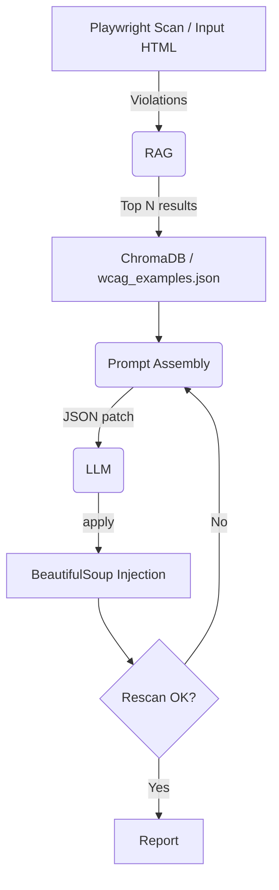

This document outlines the current methodology, architecture, and operational runbook for the automated accessibility validator pipeline used in this repository.

## 🏗️ Architecture Overview

The system operates with two cooperating layers:

- **Retrieval (RAG)**: Finds authoritative WCAG text and concrete code examples from the local corpus (`wcag.json`, `wcag_examples.json`) and ChromaDB.
- **Synthesis (Prompting + LLM)**: Assembles contextual prompts (parent DOM + retrieved knowledge + violation details) and produces strict JSON patch instructions that are applied to the DOM.



---

## Summary

- **Primary components**: `backend` (FastAPI + engine), `benchmark`, `data` (input/corrected HTML and CSVs), `frontend` preview assets, and `tests` (Playwright).
- **Core engine**: `backend.engine.AccessFixEngine` implements the agentic loop used both by the FastAPI server and the benchmarking harness.

---

## How to run (quick runbook)

1) Prepare environment (Windows example):

```powershell
$PS> d:\Code\SPL_3\myenv\Scripts\Activate.ps1
($env) PS> pip install -r requirements.txt
($env) PS> pip install -r backend\requirements.txt
```

2) Run the API server (serves analysis endpoints):

```powershell
($env) PS> uvicorn backend.main:app --host 0.0.0.0 --port 8000 --reload
```

Endpoints available:
- `POST /analyzeUrl`  -- body: `{ "url": "https://example.com" }`
- `POST /analyzeCode` -- body: `{ "code": "<html>..." }`
- `POST /analyzeFile` -- multipart file upload of an HTML file

3) Run the benchmark suite (formal evaluation):

```powershell
($env) PS> python benchmark\run_benchmark.py
```

Results and per-site CSVs are written to `benchmark/results`.

4) Quick single-run (local file):

```powershell
($env) PS> python -c "import requests; print(requests.post('http://localhost:8000/analyzeFile', files={'file': open('data/input.html','rb')}).json())"
```

5) Dev notes / debugging:

- Engine entry point: `backend.engine.AccessFixEngine` — use it directly in scripts or REPL for stepwise debugging.
- Playwright-based scanning and test automation live under `tests/` and `benchmark/`.

---

## Pipeline details (concise)

- **Scan**: Playwright + `axe-core` generates violation list and node selectors.
- **Context extraction**: Parent-node HTML is extracted via BeautifulSoup (truncated to relevant length).
- **RAG**: Create an embedding for the violation description, query ChromaDB, and select top matches plus code examples from `wcag_examples.json`.
- **Prompt assembly**: Combine parent context, RAG results, and any previous retry history into a strict system + user prompt enforcing JSON output.
- **LLM**: The model returns one structured patch object (e.g., `modify_attributes` or `replace_html`).
- **Apply**: Patches are applied to the in-memory DOM using BeautifulSoup; corrections are saved to `data/corrected.html`.
- **Rescan**: The corrected HTML is rescanned to validate the fix; if not resolved, the failure is fed back for up to 3 iterations.

---

## Implementation notes & current defaults

- **Vector DB**: ChromaDB (local).
- **Embedding model**: `mxbai-embed-large` via Ollama (configured in `backend/llm_functions.py`).
- **LLM calls**: Dispatched concurrently via `ThreadPoolExecutor` from within `backend.engine`.
- **Caching**: Identical violations are cached in-memory per-run to avoid duplicate LLM calls.

---

## Maintenance & contribution checklist

- Update `wcag.json` for canonical text changes.
- Add concrete examples to `wcag_examples.json` when new patterns are identified.
- If embedding model or ChromaDB schema changes, update `backend/llm_functions.py` and `backend/engine.py` accordingly.
- Run `python -m pytest` or Playwright tests in `tests/` after modifying the engine.

---

If you'd like, I can also:

- Add explicit example CLI commands for common workflows (URL scan, file scan, CI integration).
- Create a short `methodology/README.md` with screenshots of input/output CSVs.

(Document last updated: 2026-05-14)
